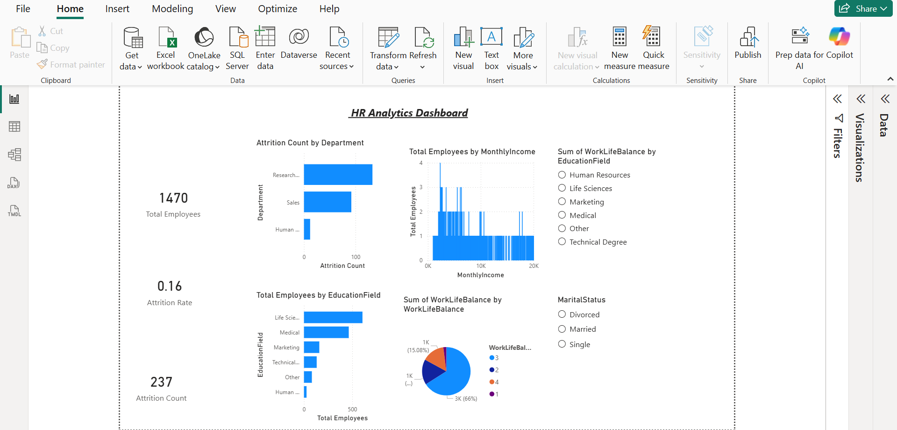

HR Analytics Dashboard (Power BI)

This project analyzes employee data to understand attrition trends, department-wise distribution, and workforce insights.

Key Features
- Total Employees, Attrition Count, Attrition Rate
- Department-wise attrition analysis
- Education field distribution
- Work-life balance insights
- Interactive filters (slicers)

Tools Used
- Power BI
- DAX
- Data Visualization

Insights
- Identified departments with high attrition
- Analyzed employee distribution across categories

Dashboard Preview

